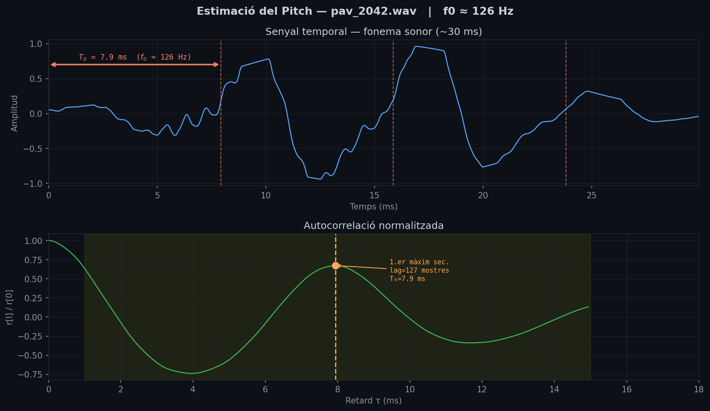
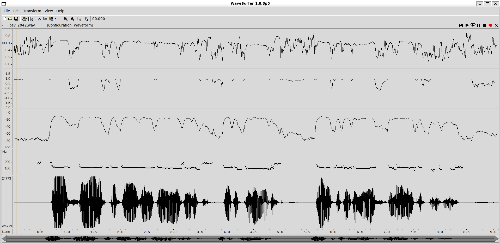
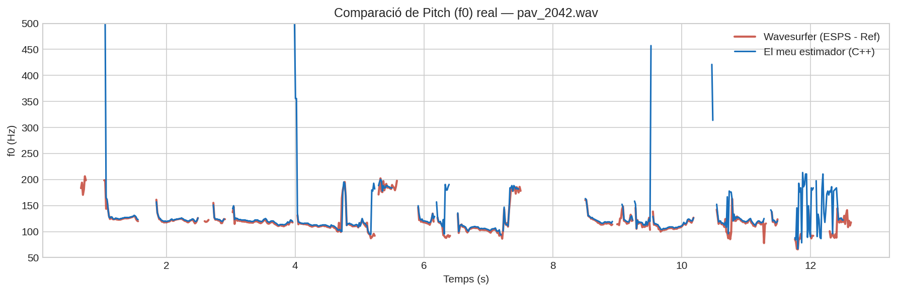
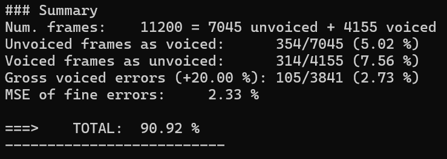
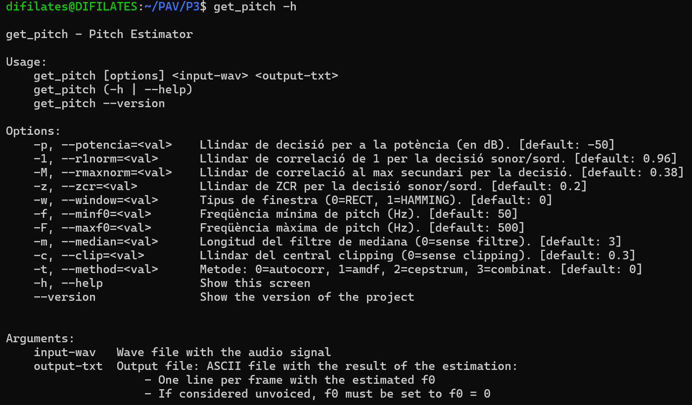
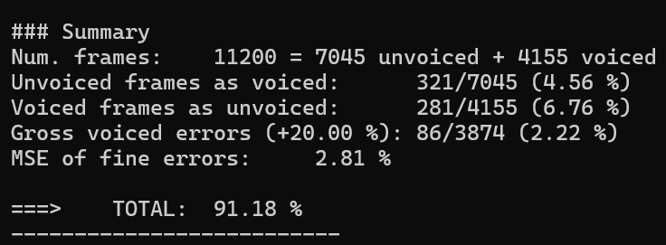
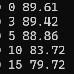
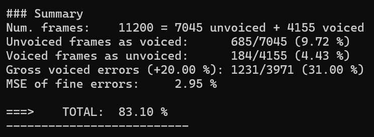
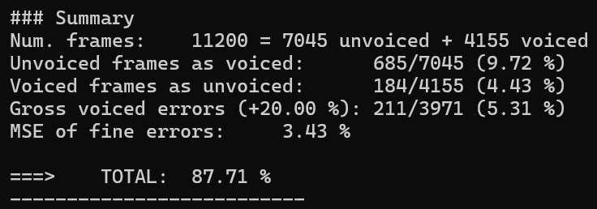
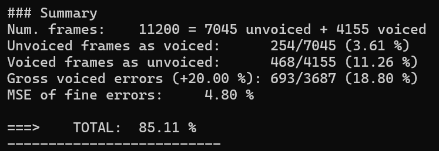

PAV - P3: estimación de pitch
=============================

Esta práctica se distribuye a través del repositorio GitHub [Práctica 3](https://github.com/albino-pav/P3).
Siga las instrucciones de la [Práctica 2](https://github.com/albino-pav/P2) para realizar un `fork` de la
misma y distribuir copias locales (*clones*) del mismo a los distintos integrantes del grupo de prácticas.

Recuerde realizar el *pull request* al repositorio original una vez completada la práctica.

Ejercicios básicos
------------------

- Complete el código de los ficheros necesarios para realizar la estimación de pitch usando el programa
  `get_pitch`.

   * Complete el cálculo de la autocorrelación e inserte a continuación el código correspondiente.

	***S'ha implementat l'autocorrelació seguint la fórmula. On per cada retard `l`, s'inicialitza `r[l]` a zero, s'acumula el producte de la senyal amb ella mateixa desplaçada `l` mostres, i es normalitza pel nombre total de mostres `N`.***
  
    ```cpp
    r[l] = 0;
    for (unsigned int n = 0; n < x.size() - l; n++){
      r[l] += x[n] * x[n + l];
    }
    r[l] /= x.size();
    ```

   * Inserte una gŕafica donde, en un *subplot*, se vea con claridad la señal temporal de un segmento de
     unos 30 ms de un fonema sonoro y su periodo de pitch; y, en otro *subplot*, se vea con claridad la
	 autocorrelación de la señal y la posición del primer máximo secundario.

	 NOTA: es más que probable que tenga que usar Python, Octave/MATLAB u otro programa semejante para
	 hacerlo. Se valorará la utilización de la biblioteca matplotlib de Python.

	***La gràfica s'ha generat amb Python utilitzant la biblioteca `matplotlib`. El segment de 30 ms correspon a un fonema sonor del fitxer `pav_2042.wav` amb una freqüència fonamental estimada de ~126 Hz (T₀ ≈ 7.94 ms). A la gràfica superior es pot observar la periodicitat de la senyal amb les marques del període de pitch. A la gràfica inferior es mostra l'autocorrelació normalitzada amb el primer màxim secundari clarament identificat a lag = 127 mostres.***

  

   * Determine el mejor candidato para el periodo de pitch localizando el primer máximo secundario de la
     autocorrelación. Inserte a continuación el código correspondiente.

	***El primer màxim secundari es localitza buscant el valor màxim de l'autocorrelació en el rang de lags corresponent a freqüències de veu humana (`npitch_min` a `npitch_max`), descartant el màxim principal en lag=0:***

    ```cpp
    iRMax = r.begin() + npitch_min;
    for(iR= iRMax; iR < r.begin() + npitch_max; ++iR){
      if(*iR > *iRMax){
        iRMax =iR;
      }
    }

    unsigned int lag = iRMax - r.begin();
    ```

   * Implemente la regla de decisión sonoro o sordo e inserte el código correspondiente.

	***La decisió sonor/sord es basa en tres criteris:***
      ***1. Si la **potència** del frame és inferior al llindar `llindar_pot`, el frame és sord.***
      ***2. Si tant `r1norm` com `rmaxnorm` són inferiors als seus llindars respectius, el frame és sord (indica absència de periodicitat).***
      ***3. Si la **taxa de creuaments per zero** (ZCR) supera el llindar `llindar_zcr`, el frame és sord (indica soroll d'alta freqüència típic de segments sords).***
    ```cpp
    if (pot < llindar_pot) {
      return true;
    }
    if (r1norm < llindar_r1norm && rmaxnorm < llindar_rmaxnorm) {
      return true;
    }
    if (zcr > llindar_zcr)
      return true;
    return false;
    ```


   * Puede serle útil seguir las instrucciones contenidas en el documento adjunto `código.pdf`.

- Una vez completados los puntos anteriores, dispondrá de una primera versión del estimador de pitch. El 
  resto del trabajo consiste, básicamente, en obtener las mejores prestaciones posibles con él.

  * Utilice el programa `wavesurfer` para analizar las condiciones apropiadas para determinar si un
    segmento es sonoro o sordo. 
	
	  - Inserte una gráfica con la estimación de pitch incorporada a `wavesurfer` y, junto a ella, los 
	    principales candidatos para determinar la sonoridad de la voz: el nivel de potencia de la señal
		(r[0]), la autocorrelación normalizada de uno (r1norm = r[1] / r[0]) y el valor de la
		autocorrelación en su máximo secundario (rmaxnorm = r[lag] / r[0]).

		Puede considerar, también, la conveniencia de usar la tasa de cruces por cero.

	    Recuerde configurar los paneles de datos para que el desplazamiento de ventana sea el adecuado, que
		en esta práctica es de 15 ms.

		***S'ha utilitzat Wavesurfer per analitzar el fitxer `pav_2042.wav` amb un desplaçament de finestra de 15 ms. Es poden observar quatre panels: l'utocorrelació al seu màxim secundari, l'autocorrelació normalitzada, la potència (r[0] en dB), l'estimació de pitch i la senyal temporal. S'observa clarament que en zones sonores la potència és alta, r1norm i rmaxnorm s'aproximen a 1, mentre que en zones sordes els valors cauen bruscament.***
        

      - Use el estimador de pitch implementado en el programa `wavesurfer` en una señal de prueba y compare
	    su resultado con el obtenido por la mejor versión de su propio sistema.  Inserte una gráfica
		ilustrativa del resultado de ambos estimadores.
     
		Aunque puede usar el propio Wavesurfer para obtener la representación, se valorará
	 	el uso de alternativas de mayor calidad (particularmente Python).

		 ***S'ha comparat l'estimació de pitch de Wavesurfer (mètode ESPS) amb el nostre estimador sobre el fitxer `pav_2042.wav`. La gràfica s'ha generat amb Python. S'observa que ambdós estimadors coincideixen en les zones clarament sonores, mentre que difereixen lleugerament en les zones de transició sonor/sord donant resultats dispersos sobretot en els límits de cada trama.***

      
  
  * Optimice los parámetros de su sistema de estimación de pitch e inserte una tabla con las tasas de error
    y el *score* TOTAL proporcionados por `pitch_evaluate` en la evaluación de la base de datos 
	`pitch_db/train`..

	***S'ha realitzat una cerca exhaustiva dels paràmetres òptims mitjançant un script bash que prova diferents combinacions de llindars sobre la base de dades d'entrenament `pitch_db/train`. Els millors paràmetres trobats han estat `-p -50 -1 0.96 -M 0.38 -z 0.20` amb un score de 90.92%***

      

Ejercicios de ampliación
------------------------

- Usando la librería `docopt_cpp`, modifique el fichero `get_pitch.cpp` para incorporar los parámetros del
  estimador a los argumentos de la línea de comandos.
  
  Esta técnica le resultará especialmente útil para optimizar los parámetros del estimador. Recuerde que
  una parte importante de la evaluación recaerá en el resultado obtenido en la estimación de pitch en la
  base de datos.

  * Inserte un *pantallazo* en el que se vea el mensaje de ayuda del programa y un ejemplo de utilización
    con los argumentos añadidos.

  	***A més dels llindars de decisió sonor/sord (`-p`, `-1`, `-M`), s'han afegit els paràmetres
`-z` per la taxa de creuaments per zero, `-w` per seleccionar el tipus de finestra
(rectangular o Hamming), `-f` i `-F` per delimitar el rang de freqüències de pitch,
`-m` per la longitud del filtre de mediana de postprocessat, `-c` per el llindar del
central clipping de preprocessat, i `-t` per seleccionar el mètode d'estimació
(autocorrelació, AMDF, cepstrum o combinat).***

	 

- Implemente las técnicas que considere oportunas para optimizar las prestaciones del sistema de estimación
  de pitch.

  Entre las posibles mejoras, puede escoger una o más de las siguientes:

  * Técnicas de preprocesado: filtrado paso bajo, diezmado, *center clipping*, etc.
 
    ***Hem fet servir el central clipping. Elimina les mostres de baixa amplitud de la senyal, reforçant la periodicitat i millorant la detecció del pitch amb un valor de 91,18%. El llindar s'aplica com un percentatge del valor màxim de la senyal.***

  

  
  * Técnicas de postprocesado: filtro de mediana, *dynamic time warping*, etc.

    ***El filtre de mediana elimina errors puntuals al contorn de pitch.***
  	***S'ha estudiat l'efecte de la longitud del filtre:***

   

  	***S'observa que la longitud 3 ofereix el millor resultat, seguit del 0, mentre que longituds majors empijtoren les prestacions en introduir distorsions al contorn de pitch.***

  
  * Métodos alternativos a la autocorrelación: procesado cepstral, *average magnitude difference function*
    (AMDF), etc.

    ***S'han implementat dos mètodes addicionals:***

    **AMDF (Average Magnitude Difference Function):**
    ***Busca el mínim de la diferència absoluta mitjana entre la senyal i la seva versió desplaçada.***
    
    **$$AMDF[l] = \frac{1}{N}\sum_{n=0}^{N-l-1} |x[n] - x[n+l]|$$**

    

    **Cepstrum:**
    ***Calcula el pitch a través del log-espectre. El pitch apareix com un pic al cepstrum en la posició corresponent al període T0.***
    
    **$$c[n] = IFFT\{\log|FFT\{x[n]\}|\}$$**

    

    ***També s'ha implementat un mètode combinat que promitja els lags obtinguts per autocorrelació i AMDF.***

    

	***Amb aquestes últimes modificacions no hem observat millores substancials en els resultats del test. Concluim que, amb aquestes condicions, l'autocorrelació segueix tenint millors resultats juntament amb el pre-processat.***


  * Optimización **demostrable** de los parámetros que gobiernan el estimador, en concreto, de los que
    gobiernan la decisión sonoro/sordo.

    ***S'ha realitzat una cerca exhaustiva del paràmetres òptims mitjançant un script que prova totes les combinacions sobre la base de dades `pitch_db/train`.***


***Els millors paràmetres trobats són:***
    
| Paràmetre | *Default* |
| :--- | :--- |
| potencia | -48 |
| r1norm | 0.95 |
| rmaxnorm | 0.38 |
| zcr | 0.24 |
| window | 1 |
| minf0 | 50 |
| maxf0 | 500 |
| median | 15 |
| clip | 0.3 |
| method | 0 |

***Score final: 91.18%***


    
  * Cualquier otra técnica que se le pueda ocurrir o encuentre en la literatura.

	***Com a tècnica addicional, s'ha incorporat la **taxa de creuaments per zero** (ZCR, 
*Zero Crossing Rate*) com a característica complementària per la decisió sonor/sord.
La veu sonora presenta un ZCR baix degut a la seva naturalesa periòdica de baixa 
freqüència, mentre que els segments sords (fricatives, silencis) presenten un ZCR 
alt característic del soroll d'alta freqüència. Aquesta característica és independent 
de l'autocorrelació i aporta informació complementària que millora la robustesa de 
la decisió sonor/sord, especialment en zones de transició.***

	***També s'ha implementat un mètode combinat que promitja els lags obtinguts per 
autocorrelació i AMDF. Aquesta tècnica es basa en el fet que els dos mètodes tenen 
errors en zones complementàries: l'autocorrelació pot fallar en senyals amb molts 
harmònics, mentre que l'AMDF és més robust en aquests casos. La combinació dels dos 
estimadors redueix la variància de l'error i millora la robustesa general del sistema,
especialment en zones de transició sonor/sord i en veus amb característiques espectrals
complexes.***

	***Finalment, s'ha realitzat una cerca exhaustiva de paràmetres mitjançant un script 
bash que avalua sistemàticament totes les combinacions possibles de llindars sobre la base de dades d'entrenament `pitch_db/train`. Aquesta aproximació permet trobar el conjunt òptim de 
paràmetres de forma demostrable i reproducible, en lloc de fer-ho de forma manual 
i subjectiva.***

  Encontrará más información acerca de estas técnicas en las [Transparencias del Curso](https://atenea.upc.edu/pluginfile.php/2908770/mod_resource/content/3/2b_PS%20Techniques.pdf)
  y en [Spoken Language Processing](https://discovery.upc.edu/iii/encore/record/C__Rb1233593?lang=cat).
  También encontrará más información en los anexos del enunciado de esta práctica.

  Incluya, a continuación, una explicación de las técnicas incorporadas al estimador. Se valorará la
  inclusión de gráficas, tablas, código o cualquier otra cosa que ayude a comprender el trabajo realizado.

  También se valorará la realización de un estudio de los parámetros involucrados. Por ejemplo, si se opta
  por implementar el filtro de mediana, se valorará el análisis de los resultados obtenidos en función de
  la longitud del filtro.
   

Evaluación *ciega* del estimador
-------------------------------

Antes de realizar el *pull request* debe asegurarse de que su repositorio contiene los ficheros necesarios
para compilar los programas correctamente ejecutando `make release`.

Con los ejecutables construidos de esta manera, los profesores de la asignatura procederán a evaluar el
estimador con la parte de test de la base de datos (desconocida para los alumnos). Una parte importante de
la nota de la práctica recaerá en el resultado de esta evaluación.
